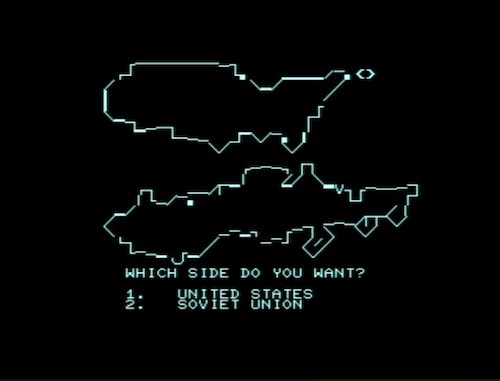

# Global Thermonuclear War



Homage to the film [Wargames](https://en.wikipedia.org/wiki/WarGames)

A recreation of the [scene](https://www.youtube.com/watch?v=KXzNo0vR_dU&t=92) where David and Jennifer first interact with the WOPR.

Thanks to George Phillips for his [ASCII recreation](http://48k.ca/wgascii.html) of the maps used in the menu.

You can also watch a play through on [YouTube](https://www.youtube.com/watch?v=R65BBGmOPdw).

# Installation

Install the dependencies:

* [Kick Assembler](http://www.theweb.dk/KickAssembler)
* [VICE emulator](http://vice-emu.sourceforge.net/)
* [cgl-6502](https://github.com/peckhamdata/cgl-6502) 6502 Character Graphics Library

Set these environment variables:

* `KICK_HOME` - Location of Kick Assembler
* `VICE_HOME` - Location of VICE Emulator
* `KICK_LIB_DIR` - Location of 6502 Character Graphics Library

# Usage

To run type `make`

Keyboard input is set up for a [Pet Graphics Keyboard](http://www.6502.org/users/andre/petindex/keyboards.html) as this what the machine I was targetting when I wrote this had.

# Emulating on Windows

* [Download VICE Emulator](https://vice-emu.sourceforge.io/index.html#download)
* Extract the latest nightly build from `MEGA.nz`. The file should have a name like `GTK3VICE-3.5-win64-r40445.7z` (so use [7z](https://www.7-zip.org/download.html))
* Download the pre-compiled `war.d64` from the [Releases Page](https://github.com/peckhamdata/global-thermonuclear-war/releases)
* Head into the directory where you extracted VICE (for me this was `C:\Users\black\Downloads\GTK3VICE-3.5-win64-r40445`), then enter the `bin` folder.
* Double-click `xpet.exe`
* You should hear a flashing beeping sound, then the commodore prompt
* Press `Preferences -> Settings` (or Alt-O)
* Go to `Machine -> Model`
* Select the Model as `PET 4032` because we need 40 columns :)
* Select the Keyboard type as `Graphics (us)`
* Close out of the settings menu
* Press `File -> Attach disk image -> Drive #8` (or press Alt+8)
* Go to the downloaded `war.d64` (or if you compiled it yourself navigate to where you did this) and double-click it to insert it.
* In the Commodore prompt you should see something like:
```
*** COMMODORE BASIC 4.0 ***
 31743 BYTES FREE
READY.

```
 * Type into the prompt:
```
LOAD "*",8,1
```
 * Then press Return (enter). Loading may take some time!
 * You should see something like this on your screen:
```
*** COMMODORE BASIC 4.0 ***
 31743 BYTES FREE
READY.
LOAD "*",8,1

SEARCHING FOR $
LOADING
READY.
```
 * We now need to clear the screen, to do this press <kbd>Shift</kbd> + <kbd>Home</kbd>
 * Then type into the prompt:
```
SYS 4000
```
 * Then press Return (enter)
 * Enjoy!
